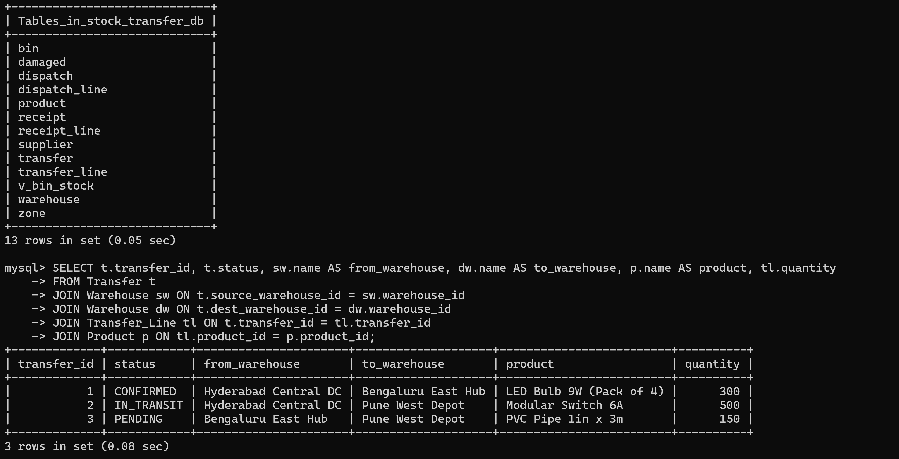

# Given Query

## Problem

Write a query to display the details of every stock transfer, showing the transfer ID, its status, the names of the source and destination warehouses, the product being transferred, and the quantity.

## Query

```sql
SELECT t.transfer_id, t.status, sw.name AS from_warehouse, dw.name AS to_warehouse, p.name AS product, tl.quantity
FROM Transfer t
JOIN Warehouse sw ON t.source_warehouse_id = sw.warehouse_id
JOIN Warehouse dw ON t.dest_warehouse_id = dw.warehouse_id
JOIN Transfer_Line tl ON t.transfer_id = tl.transfer_id
JOIN Product p ON tl.product_id = p.product_id;
```

## Solution


