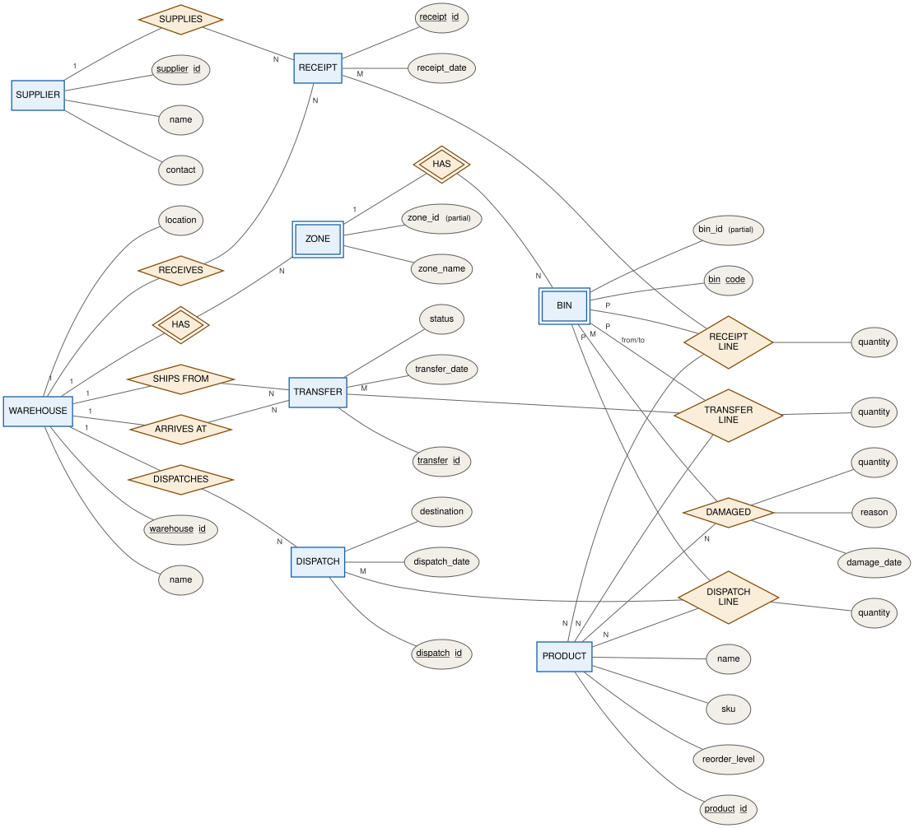

# Multi-Warehouse Stock Transfer Management System

**DBMS Course Project 09** · *Design and Implementation of a Database Management System for Multi-Warehouse Stock Transfer*

| | |
|---|---|
| **Name** | Katamreddy Shreenandh |
| **Roll No.** | 25WU0102119 |
| **Section** | CSE-AI&ML Panthers |
| **University** | Woxsen University |

A MySQL database that tracks every unit of stock across several warehouses, from receipt to bin to transfer to dispatch, so that stock in transit is never counted twice or lost.

---

## Problem Statement

A company running several warehouses needs to trace stock from the moment it is **received**, through the **bin** it is put away in, to the moment it is **dispatched**. Today that chain breaks down. The worst case is the **unconfirmed transfer**: stock has left the source warehouse but the destination has not yet confirmed it. The system then either counts it at both ends or at neither, and the balances at both warehouses are wrong.

### Scope

- **In scope:** warehouses, zones, bins, products, suppliers, and every physical stock movement: receiving, put-away, inter-warehouse transfer with confirmation, dispatch and damage. These are modelled as one ER schema, mapped to a 3NF relational schema, and the business rules are enforced as database constraints so that reports (stock levels, pending transfers, bin utilisation, reorder needs) stay accurate.
- **Out of scope:** purchasing, invoicing, carrier tracking, pricing and payroll.

### Users

| Role | Responsibility |
|---|---|
| Warehouse Manager | Approves transfers; reviews stock and reorder reports |
| Store Keeper | Records receipts; puts stock away into bins |
| Transfer Officer | Initiates transfers; confirms arrival at the destination |
| Auditor | Read-only access to balances, ageing and damage records |

### Functional Requirements

| ID | Requirement |
|---|---|
| FR-01 | Record a receipt of goods from a supplier |
| FR-02 | Put received stock away into a bin |
| FR-03 | Search stock by product, bin or warehouse |
| FR-04 | Initiate an inter-warehouse transfer |
| FR-05 | Confirm arrival before the destination is credited |
| FR-06 | Dispatch stock to an external destination |
| FR-07 | Record damaged stock |
| FR-08 | Report on stock levels, pending transfers and reorder needs |

### Business Rules

1. Source and destination warehouse of a transfer must differ.
2. The destination is credited only once a transfer is `CONFIRMED`.
3. Bin codes are unique.
4. All movement quantities (received, transferred, dispatched, damaged) must be positive.
5. Transfer quantity may not exceed the stock in the source bin (planned as a trigger).

---

## ER Diagram

Conceptual model in Chen notation (rectangles = entities, double rectangles = weak entities, diamonds = relationships, ellipses = attributes, underlined = key).



**Notes on the model**

- **Zone** and **Bin** are weak entities: a zone exists only inside a warehouse and a bin only inside a zone (FK is `NOT NULL` with `ON DELETE CASCADE`). The diagram shows their partial keys; in the implemented schema each has a single-column surrogate key (`zone_id`, `bin_id`) so every foreign key is one column.
- **Transfer** has two roles into Warehouse (*ships from* / *arrives at*), and **Transfer_Line** has two roles into Bin (*from bin* / *to bin*).
- The four `*_LINE` / `DAMAGED` relationships are M:N relationships that carry a `quantity`, so each becomes its own table.

---

## Tables

The schema is in [stock_transfer_db.sql](stock_transfer_db.sql) (MySQL 8.0.16+, InnoDB). It has 12 tables and 1 view.

| # | Table | Type | Purpose |
|---|---|---|---|
| 1 | `Supplier` | Master | Vendors that goods are received from |
| 2 | `Warehouse` | Master | Physical warehouse locations |
| 3 | `Product` | Master | Items stocked, with SKU and reorder level |
| 4 | `Zone` | Weak entity | A section within a warehouse |
| 5 | `Bin` | Weak entity | A storage slot within a zone |
| 6 | `Receipt` | Transaction header | Inbound delivery from a supplier |
| 7 | `Receipt_Line` | Transaction line | Product and quantity put away to a bin |
| 8 | `Transfer` | Transaction header | Inter-warehouse movement with status |
| 9 | `Transfer_Line` | Transaction line | Product moved from a source bin to a destination bin |
| 10 | `Dispatch` | Transaction header | Outbound shipment to an external destination |
| 11 | `Dispatch_Line` | Transaction line | Product and quantity picked from a bin |
| 12 | `Damaged` | Event | Stock written off from a bin, with reason |
| — | `v_bin_stock` | View | Live on-hand stock per bin and product, derived from all movements |

**Integrity enforcement:** primary keys, unique keys (`Supplier.name`, `Warehouse.name`, `Product.sku`, `Bin.bin_code`, `(warehouse_id, zone_name)`), 19 foreign keys, `CHECK` constraints (positive quantities, valid transfer status, source ≠ destination), and three triggers that block confirming a transfer until every line has a destination bin.

Stock balances are **not stored**. `v_bin_stock` computes them from the movement tables: a transfer leaves the source bin once `IN_TRANSIT` or `CONFIRMED` and is credited to the destination bin only when `CONFIRMED`.

---

## Relational Schema

`→ Table` marks a foreign key. The primary key of each relation is listed in the table below.

```
Supplier      (supplier_id, name, contact)
Warehouse     (warehouse_id, name, location)
Product       (product_id, name, sku, reorder_level)
Zone          (zone_id, zone_name, warehouse_id → Warehouse)
Bin           (bin_id, bin_code, zone_id → Zone)

Receipt       (receipt_id, receipt_date, supplier_id → Supplier, warehouse_id → Warehouse)
Transfer      (transfer_id, status, transfer_date,
               source_warehouse_id → Warehouse, dest_warehouse_id → Warehouse)
Dispatch      (dispatch_id, destination, dispatch_date, warehouse_id → Warehouse)

Receipt_Line  (receipt_id → Receipt, bin_id → Bin, product_id → Product, quantity)
Transfer_Line (transfer_id → Transfer, source_bin_id → Bin, product_id → Product,
               dest_bin_id → Bin [nullable], quantity)
Dispatch_Line (dispatch_id → Dispatch, bin_id → Bin, product_id → Product, quantity)
Damaged       (bin_id → Bin, product_id → Product, damage_date, quantity, reason)
```

| Relation | Primary key |
|---|---|
| Supplier | **supplier_id** |
| Warehouse | **warehouse_id** |
| Product | **product_id** |
| Zone | **zone_id** |
| Bin | **bin_id** |
| Receipt | **receipt_id** |
| Transfer | **transfer_id** |
| Dispatch | **dispatch_id** |
| Receipt_Line | **(receipt_id, bin_id, product_id)** |
| Transfer_Line | **(transfer_id, source_bin_id, product_id)** |
| Dispatch_Line | **(dispatch_id, bin_id, product_id)** |
| Damaged | **(bin_id, product_id, damage_date)** |

All relations are in **3NF**: every non-key attribute depends on the whole key and on nothing else. For example, a bin's warehouse is reached through `Zone` and not stored on `Bin`.

---

## Files

| File | Description |
|---|---|
| [ER_Diagram.svg](ER_Diagram.svg) | ER diagram (Chen notation) |
| [stock_transfer_db.sql](stock_transfer_db.sql) | DDL, constraints, triggers, view and sample data |
| [verify_stock_transfer_db.sql](verify_stock_transfer_db.sql) | Checks engines, row counts and foreign keys, and dumps every table |

### Running

```bash
mysql -u root -p < stock_transfer_db.sql
```

```bash
mysql -u root -p < verify_stock_transfer_db.sql
```
